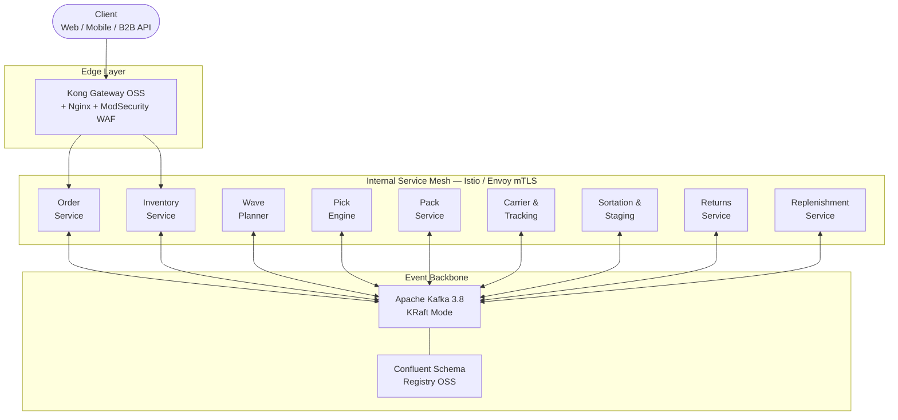
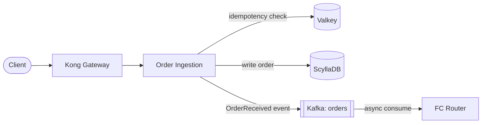
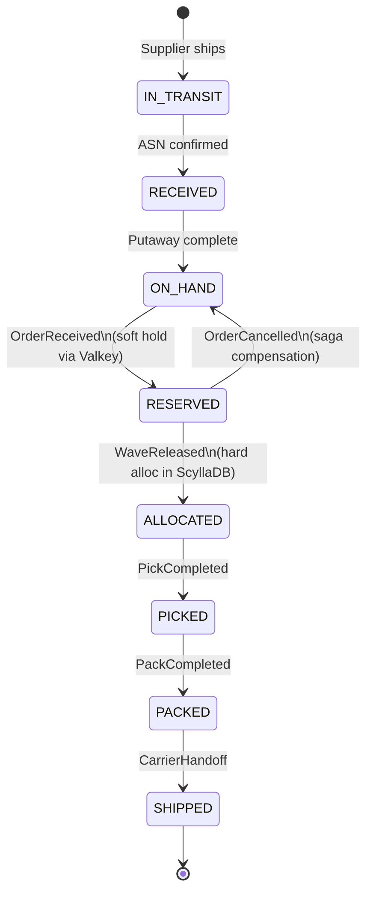
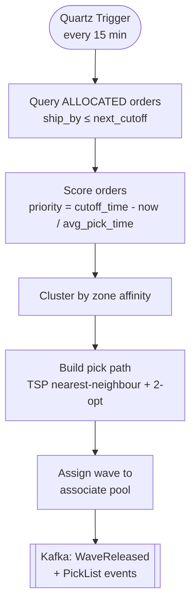
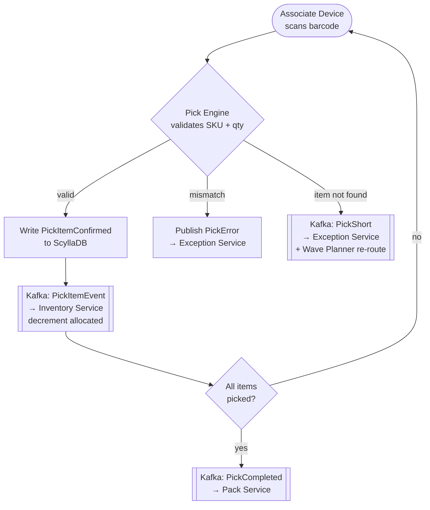
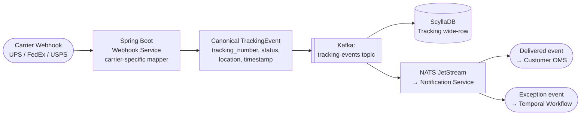
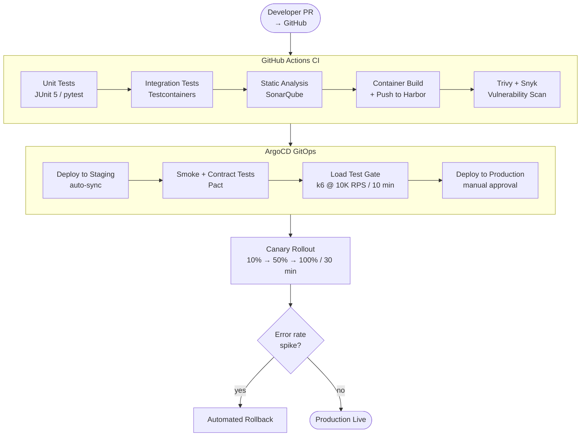
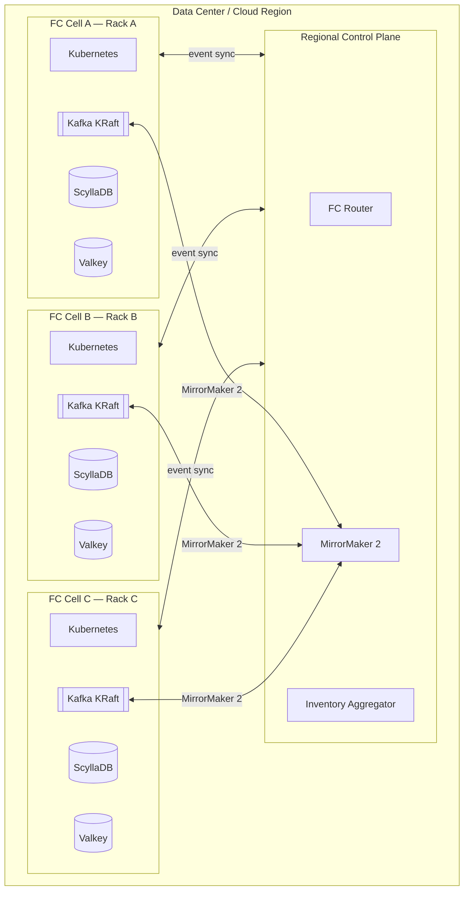

# System Design Specification: Warehouse Fulfillment System

**Version:** 1.0  
**Date:** May 9, 2026  
**Status:** Draft  
**Reference PRD:** [PRD-fulfillment-system.md](./PRD-fulfillment-system.md)

---

## 1. Design Principles

| Principle | Description |
|-----------|-------------|
| **Cell-based architecture** | Each fulfillment center (FC) is a self-contained cell; FCs operate independently and tolerate central control plane failures |
| **Event sourcing** | All state changes are derived from an immutable event log; no direct DB-to-DB calls |
| **CQRS** | Command (write) and Query (read) paths are separated per domain |
| **Saga / choreography** | Long-running workflows (order → ship) coordinated via domain events, not distributed transactions |
| **Bulkheads** | Each domain service has its own thread pools, DB clusters, and Kafka consumer groups; failure is isolated |
| **Stateless compute** | All application servers are stateless; state lives in managed data stores |
| **Defense in depth** | mTLS between services, secrets in Vault, least-privilege IAM everywhere |

---

## 2. High-Level Architecture



---

## 3. Domain Services — Tech Stack Deep Dive

---

### 3.1 Order Ingestion Service

**Responsibility:** Accept, validate, deduplicate, and route orders to the correct FC.

#### Tech Stack

| Layer | Technology | Rationale |
|-------|-----------|-----------|
| **Runtime** | Java 25 (Virtual Threads + Value Types) on Kubernetes | Java 25 LTS; Project Loom VT + Valhalla value types reduce heap pressure |
| **Framework** | Spring Boot 4.x + Spring WebFlux | Non-blocking HTTP; Spring Boot 4 targets Jakarta EE 11 + Java 25 baseline |
| **API Gateway** | Kong Gateway OSS (REST) + Envoy (gRPC) | Edge throttling, auth, plugin ecosystem; fully open-source |
| **Async messaging** | Apache Kafka 3.8 (KRaft, self-hosted) | `orders` topic; partitioned by `customer_id` |
| **Deduplication store** | Valkey 8 (self-hosted, Redis-compatible) | Idempotency key TTL-based dedup (24h window); Linux Foundation OSS |
| **Order DB (write)** | ScyllaDB 6 (Cassandra-compatible) | Sub-ms p99 writes; partition key `order_id`; used at Discord/Comcast scale |
| **Order DB (read)** | PostgreSQL 17 + Patroni (CloudNativePG operator) | Complex status queries, joins for ops dashboards; HA via Patroni |
| **Schema validation** | Confluent Schema Registry OSS (Avro) | Schema evolution with backward compat; Apache 2.0 licensed |
| **FC routing** | Custom routing service (rules engine + ML model) | Proximity, capacity, carrier SLA scoring |
| **Tracing** | Jaeger + OpenTelemetry Collector | End-to-end trace per order; CNCF graduated project |
| **Config** | Unleash (self-hosted) | Feature flags, routing weights; open-source feature management |

#### Data Flow



#### CQRS Split

| Side | Class | Responsibility |
|------|-------|---------------|
| **Write** | `CreateOrderCommandHandler` | Idempotency guard (ScyllaDB LWT), persist order, publish `OrderReceived` to Kafka |
| **Read** | `GetOrderQueryHandler` | Query ScyllaDB by `order_id`; return `CreateOrderResponse` read model |
| *(deprecated)* | `OrderService` | Monolithic service class — marked `@Deprecated(forRemoval = true)`; empty shell retained for git history |

Shared interfaces: `Command`, `CommandHandler<C,R>`, `Query<R>`, `QueryHandler<Q,R>` from `libs/common-cqrs` (`com.shipping.cqrs`).

`OrderController` injects `CreateOrderCommandHandler` and `GetOrderQueryHandler` directly — no intermediate service layer.

#### Key Design Decisions
- **Idempotency:** Every `POST /orders` requires a client-supplied `Idempotency-Key` header stored in Valkey for 24h.
- **Order splitting:** If no single FC can fulfill all items, the router splits into child orders; a parent-child order graph is stored in ScyllaDB.
- **Backpressure:** Kong Gateway enforces token-bucket rate limiting (10K RPS per route); Kafka consumer lag monitored via Prometheus + Grafana.

---

### 3.2 Inventory Service

**Responsibility:** Maintain the real-time inventory ledger; handle reservations, allocations, and adjustments.

#### Tech Stack

| Layer | Technology | Rationale |
|-------|-----------|-----------|
| **Runtime** | Java 25 on Kubernetes | Same fleet as order service |
| **Inventory Ledger DB** | ScyllaDB 6 (LWT for strong consistency) | `(fc_id, sku)` partition key; Lightweight Transactions for atomic counters |
| **Reservation cache** | Valkey 8 (self-hosted) with Lua scripts | Atomic soft-hold operations; avoids hot-partition writes on ScyllaDB |
| **Event store** | Apache Kafka 3.8 | `inventory-events` topic; all mutations sourced from events |
| **Read model** | OpenSearch 2.x (self-hosted, OpenSearch Operator) | Full-text + aggregation queries; inventory search by category/FC |
| **Conflict resolution** | Optimistic locking via ScyllaDB LWT (`IF` conditions) | Prevents double-reservation under high concurrency |
| **Batch adjustments** | Apache Spark 3.5 (K8s Spark Operator) + MinIO | Nightly cycle count reconciliation from WMS; S3-compatible object store |
| **Demand forecasting integration** | MLflow + Ray Serve (REST inference endpoint) | Called by replenishment trigger; portable, cloud-agnostic |
| **Alerts** | Alertmanager + NATS JetStream | Low-stock alerts to planners via pub/sub |
| **Tracing** | Jaeger + OpenTelemetry Collector | — |

#### Inventory State Machine



#### CQRS Split

| Side | Class | Responsibility |
|------|-------|---------------|
| **Write** | `ReserveInventoryCommandHandler` | Valkey Lua atomic check-and-decrement (fast path); ScyllaDB LWT fallback; publishes `InventoryReserved` or `InventoryInsufficient` |
| **Read** | `GetStockQueryHandler` | Query OpenSearch for inventory levels; return read-model view |
| *(deprecated)* | `InventoryService` | Marked `@Deprecated(forRemoval = true)`; empty shell retained for git history |

#### Key Design Decisions
- **Hot key mitigation:** High-velocity SKUs use Valkey Lua scripts for reservation rather than writing directly to ScyllaDB on every order. Periodic flush from Valkey → ScyllaDB.
- **Eventual vs. strong consistency:** Reservations (money-like) use ScyllaDB LWT (strong). Inventory search / reporting uses self-hosted OpenSearch (eventual).
- **Saga compensation:** If order is cancelled after reservation, a `CompensateInventory` command is published to restore stock within 5s SLA.

---

### 3.3 Wave Planning Service

**Responsibility:** Group reserved orders into pick waves; generate optimized pick lists.

#### Tech Stack

| Layer | Technology | Rationale |
|-------|-----------|-----------|
| **Runtime** | Python 3.12 on Kubernetes | Optimization algorithms; NumPy/SciPy ecosystem |
| **Scheduler** | Quartz Scheduler (embedded in service) | Triggers wave generation every N minutes (default 15); no external dependency |
| **Wave DB** | PostgreSQL 17 + Patroni (CloudNativePG) | Relational wave–order–picklist joins |
| **Graph / path optimization** | NetworkX + custom A* on warehouse layout graph | Minimize picker travel distance |
| **Carrier cutoff data** | Valkey 8 (self-hosted) | Real-time cutoff windows per carrier per FC |
| **Pick list queue** | Apache Kafka 3.8 | `picklists` topic; partitioned by `fc_id#zone` |
| **Associate assignment** | ScyllaDB 6 | `(fc_id, associate_id)` partition; workload tracking |
| **Priority engine** | Rules-based (SLA deadline - current time) / tie-break by carrier cutoff | Configurable via Unleash feature flags |

#### Wave Algorithm (simplified)



---

### 3.4 Pick Engine

**Responsibility:** Guide associates through picks; record confirmations and exceptions.

#### CQRS Split

| Side | Class | Responsibility |
|------|-------|---------------|
| **Write** | `CreatePickTasksCommandHandler` | Materialises one `PickTask` row in ScyllaDB per line item from the `PickList` Kafka event |
| **Write** | `ConfirmScanCommandHandler` | Records barcode scan confirmation in ScyllaDB; publishes `PickItemEvent` to Kafka |
| **Read** | `NextTaskQueryHandler` | Returns the next unconfirmed pick task for a given associate |
| **Read** | `PickListStatusQueryHandler` | Returns completion status of a pick list |
| *(deprecated)* | `PickTaskService` | Marked `@Deprecated(forRemoval = true)`; empty shell retained for git history |

#### Tech Stack

| Layer | Technology | Rationale |
|-------|-----------|-----------|
| **Runtime** | Java 25 on Kubernetes | Low-latency response to handheld devices |
| **Associate device protocol** | WebSocket via Netty (embedded in Spring Boot 4) | Real-time bi-directional comms to RF scanners / tablets; no external gateway |
| **State store** | ScyllaDB 6 | `(picklist_id, item_seq)` clustering key; per-item status |
| **Scan verification** | In-process barcode checksum + ScyllaDB lookup | Confirm item SKU matches expected |
| **Exception queue** | Apache Kafka (single-partition topic for ordering) | Pick shorts, wrong items → exception workflow; reuses existing Kafka cluster |
| **Voice picking** | Vocollect integration (REST API to Vocollect server) | Android Talkman device support |
| **AMR integration** | REST/gRPC to open robot fleet controller (ROS 2 / FlexBE) | Goods-to-person robotics integration |
| **Metrics** | Prometheus + Grafana | Picks/hr per associate; error rates |

#### Pick Confirmation Flow



---

### 3.5 Pack Service

**Responsibility:** Recommend carton, print label, capture packed weight, emit shipment record.

#### Tech Stack

| Layer | Technology | Rationale |
|-------|-----------|-----------|
| **Runtime** | Java 25 on Kubernetes | — |
| **Pack station UI** | React 18 (TypeScript) served via Nginx (on K8s) | Touch-screen pack station terminals |
| **Carton recommendation** | 3D bin-packing algorithm (Python microservice) | First-fit decreasing heuristic; dims from product catalog |
| **Product dims catalog** | ScyllaDB 6 | `(sku)` partition key; weight, length, width, height |
| **Label generation** | ZPL template engine → Zebra printer (raw TCP) | Carrier-compliant label per carrier spec |
| **Carrier rate shopping** | EasyPost OSS SDK + Shippo API | Multi-carrier label purchase; no vendor lock-in |
| **Weight capture** | Scale integration via serial/USB → local agent (Go) | Captures gross weight; validates vs. estimated |
| **Shipment DB** | ScyllaDB 6 | `(shipment_id)` partition key |
| **Compliance** | Hazmat rules engine (Drools embedded) | Flags DG items; adds required markings |
| **Event** | Kafka `shipments` topic | `OrderPacked` event |

---

### 3.6 Sortation & Staging Service

**Responsibility:** Assign packed cartons to carrier lanes; manage dock staging.

#### Tech Stack

| Layer | Technology | Rationale |
|-------|-----------|-----------|
| **Runtime** | Java 25 on Kubernetes | — |
| **Conveyor PLC integration** | OPC-UA client (Eclipse Milo) | Industrial protocol to sortation PLC; divert signals |
| **Sortation DB** | ScyllaDB 6 | `(carton_id)` partition key; lane assignment |
| **Lane manifest** | PostgreSQL 17 + Patroni (CloudNativePG) | Relational grouping: lane → carrier → route |
| **Cutoff alerting** | Alertmanager + NATS JetStream + PagerDuty webhook | Alert ops when lane behind schedule |
| **Dock management UI** | React 18 + WebSocket | Real-time carton count per lane |

---

### 3.7 Carrier & Tracking Service

**Responsibility:** Transmit manifests to carriers; ingest and normalize tracking events.

#### CQRS Split

| Side | Class | Responsibility |
|------|-------|---------------|
| **Write** | `TransmitManifestCommandHandler` | Sends carrier manifest via EDI (Apache Camel X12 856); records handoff in ScyllaDB |
| **Read** | `GetTrackingQueryHandler` | Reads the `tracking` wide-row table in ScyllaDB; projects rows to `TrackingEventView` read model |
| *(deprecated)* | `ManifestService` | Marked `@Deprecated(forRemoval = true)`; empty shell retained for git history |

#### Tech Stack

| Layer | Technology | Rationale |
|-------|-----------|-----------|
| **Runtime** | Java 25 on Kubernetes | — |
| **Carrier integrations** | Carrier-specific SDKs + EasyPost OSS SDK | UPS, FedEx, USPS, regional carriers |
| **EDI** | Apache Camel 4 (Smooks EDI transformer, X12 856 ASN) | Electronic manifest to carriers; fully open-source EDI pipeline |
| **Tracking ingestion** | Spring Boot 4 webhook service + Kafka | Carrier scan webhooks → normalized events; no FaaS dependency |
| **Tracking DB** | ScyllaDB 6 (append-only wide row) | `(tracking_number, event_time)` clustering; event timeline |
| **Exception detection** | Temporal (open-source workflow engine) | Delayed / stuck shipment detection; durable saga execution |
| **Notifications** | NATS JetStream → Notification Service | Push to customer order management; lightweight pub/sub |
| **Carrier cutoff sync** | Quartz Scheduler → carrier API polling | Keep cutoff windows fresh |

#### Tracking Event Normalization



---

### 3.8 Returns Service

**Responsibility:** Process inbound returns: receive, inspect, route to restock or liquidation.

#### Tech Stack

| Layer | Technology | Rationale |
|-------|-----------|-----------|
| **Runtime** | Java 25 on Kubernetes | — |
| **Returns DB** | ScyllaDB 6 | `(return_id)` partition key; status, condition |
| **Label generation** | Same stack as Pack Service (EasyPost OSS SDK) | Prepaid return label |
| **Condition capture UI** | React 18 on tablet | Associate scans item, selects condition (A/B/C/Damage) |
| **Routing rules engine** | Drools 10 (embedded) | Condition + category → RESTOCK / QUARANTINE / LIQUIDATION |
| **Inventory update** | Kafka event → Inventory Service | `ReturnRestocked` triggers on-hand increment |
| **Refund trigger** | Kafka event → Order Management System | `ReturnAccepted` event |
| **Analytics** | Return events → Apache Kafka → MinIO (S3-compatible) → Apache Trino | Return rate by SKU, reason code |

---

### 3.9 Replenishment Service

**Responsibility:** Monitor inventory levels; trigger and manage inbound purchase orders and FC transfers.

#### Tech Stack

| Layer | Technology | Rationale |
|-------|-----------|-----------|
| **Runtime** | Python 3.12 on Kubernetes | ML inference + data pipeline friendly |
| **Inventory monitoring** | Consumes `inventory-events` Kafka topic | Stream processing via Apache Flink 1.20 (K8s Flink Operator) |
| **Reorder logic** | Apache Flink stateful stream processor | Maintains per-SKU rolling demand window; fires replenishment trigger |
| **Demand forecasting** | MLflow 2.x + Ray Serve (DeepAR / Chronos model) | Time-series forecast per SKU per FC; portable OSS model serving |
| **PO generation** | ScyllaDB (POs) + Apache Camel → Supplier EDI (X12 850) | Purchase order to supplier; Apache Camel handles EDI transformation |
| **Transfer order** | Internal REST API to FC Transfer Service | Move stock between FCs |
| **ASN ingestion** | EDI X12 856 (inbound) via Apache Camel 4 (Smooks) | Supplier advance ship notice; fully open-source EDI |
| **Putaway** | PostgreSQL 17 (slotting rules) + ScyllaDB (task queue) | Optimal bin assignment based on velocity class |
| **Slotting optimizer** | Python + SciPy (periodic batch job via Apache Airflow) | Re-slots slow movers monthly |
| **Dashboard** | Apache Superset | Replenishment KPIs; PO pipeline; in-transit inventory |

#### Replenishment Trigger Formula

$$\text{Reorder Point} = \bar{d} \times L + z \times \sigma_d \times \sqrt{L}$$

Where:
- $\bar{d}$ = average daily demand (from MLflow + Ray Serve DeepAR forecast)
- $L$ = supplier lead time (days)
- $z$ = service level factor (e.g., 1.65 for 95%)
- $\sigma_d$ = standard deviation of daily demand

---

## 4. Cross-Cutting Infrastructure

### 4.1 Event Backbone — Apache Kafka (Self-Hosted, KRaft Mode)

| Config | Value |
|--------|-------|
| Kafka version | 3.8.x (KRaft — no ZooKeeper) |
| Brokers per cluster | 9 (3 AZs × 3) |
| Replication factor | 3 |
| Retention | 7 days (orders, inventory); 30 days (tracking) |
| Schema registry | Confluent Schema Registry OSS (Avro); Apache 2.0 |
| Consumer groups | Per domain service; independent lag |
| Partitioning | By `fc_id` for locality; by `order_id` for ordering |
| Monitoring | Kafka Exporter → Prometheus + Grafana; Burrow for consumer lag |

#### Core Topics

| Topic | Partitions | Key |
|-------|-----------|-----|
| `orders` | 256 | `order_id` |
| `inventory-events` | 512 | `fc_id#sku` |
| `picklists` | 128 | `fc_id#zone` |
| `shipments` | 256 | `shipment_id` |
| `tracking-events` | 256 | `tracking_number` |
| `returns` | 64 | `return_id` |
| `replenishment` | 64 | `fc_id#sku` |

---

### 4.2 Compute — Kubernetes (Self-Managed / Any Distribution)

| Config | Value |
|--------|-------|
| Cluster version | Kubernetes 1.32+ |
| Node groups | Karpenter OSS; mixed bare-metal + VM nodes |
| Workload isolation | Namespace per domain; NetworkPolicy enforced |
| Service mesh | Istio 1.23 (Envoy) with mTLS; CNCF graduated |
| Autoscaling | HPA (CPU/custom Kafka lag metric via KEDA) |
| Pod disruption budgets | ≥ 1 pod always available per critical service |
| Image registry | Harbor (CNCF graduated; vulnerability scanning built-in) |
| GitOps | ArgoCD; all manifests in Git |

---

### 4.3 Data Stores Summary

| Domain | Primary Store | Read Model | Cache |
|--------|-------------|-----------|-------|
| Orders | ScyllaDB 6 | PostgreSQL 17 + Patroni (RR) | Valkey 8 |
| Inventory | ScyllaDB 6 | OpenSearch 2.x (self-hosted) | Valkey 8 |
| Wave Planning | PostgreSQL 17 + Patroni | — | Valkey 8 |
| Pick Engine | ScyllaDB 6 | — | — |
| Pack / Shipment | ScyllaDB 6 | — | — |
| Sortation | ScyllaDB 6 | PostgreSQL 17 + Patroni | — |
| Carrier / Tracking | ScyllaDB 6 (wide row) | — | — |
| Returns | ScyllaDB 6 | MinIO + Apache Trino | — |
| Replenishment | ScyllaDB 6 + PostgreSQL 17 | Apache Superset | — |

---

### 4.4 Security

| Concern | Solution |
|---------|---------|
| **Authentication** | Keycloak 25 (external OIDC/SAML); SPIFFE/SPIRE (internal service identity) |
| **Authorization** | RBAC via OPA (Open Policy Agent) sidecar; Keycloak roles |
| **Encryption in transit** | TLS 1.3 everywhere; mTLS between services via Istio/Envoy |
| **Encryption at rest** | HashiCorp Vault Transit Secrets Engine (per domain key); ScyllaDB + Kafka + MinIO all encrypted |
| **Secrets** | HashiCorp Vault on Kubernetes; secrets injected via Vault Agent Injector |
| **Network** | Network namespaces per environment; private subnets only; no public IPs on pods |
| **Vulnerability scanning** | Trivy (on Harbor registry, OSS); Snyk in CI pipeline |
| **Audit logging** | Custom audit events → MinIO WORM bucket (immutable object lock) |
| **PII** | Customer address/name encrypted at field level (Google Tink, open-source) |

---

### 4.5 Observability Stack

| Signal | Tool | Notes |
|--------|------|-------|
| **Metrics** | Prometheus 3.x + Grafana 11 | Scrape all services + Kafka Exporter + ScyllaDB Exporter |
| **Tracing** | Jaeger 2 + OpenTelemetry Collector | 100% sampling for orders; 1% sampling for pick/pack; CNCF graduated |
| **Logging** | Fluent Bit → OpenSearch 2.x (self-hosted, K8s OpenSearch Operator) | Structured JSON logs; 30-day retention |
| **Alerting** | Alertmanager + PagerDuty webhook | P1 pages on SLA breach; P2/P3 on Slack |
| **Dashboards** | Grafana (operational) + Apache Superset (business KPIs) | |
| **Synthetic monitoring** | Grafana k6 (scripted synthetic flows, open-source) | Simulate order flow every 60s |
| **Chaos engineering** | Chaos Mesh (CNCF; K8s-native fault injection) | Monthly chaos days; test cell isolation |

---

### 4.6 CI/CD Pipeline



---

### 4.7 CQRS — Shared Library & Per-Service Pattern

All Java services implement an **in-process CQRS model** backed by a shared library in `libs/common-cqrs` (`com.shipping.cqrs`).

#### Shared interfaces (`libs/common-cqrs`)

| Interface | Role |
|-----------|------|
| `Command` | Marker interface for all write-side intents |
| `Query<R>` | Marker interface for all read-side intents; `R` is the return type |
| `CommandHandler<C extends Command, R>` | `@FunctionalInterface`; one implementation per command type |
| `QueryHandler<Q extends Query<R>, R>` | `@FunctionalInterface`; one implementation per query type |

#### Per-service package structure

```
application/
  command/
    XxxCommand.java          ← record implements Command
    XxxCommandHandler.java   ← @Service implements CommandHandler<XxxCommand, R>
  query/
    XxxQuery.java            ← record implements Query<R>
    XxxQueryHandler.java     ← @Service implements QueryHandler<XxxQuery, R>
    XxxResult.java           ← read-model record (where needed)
```

#### Rules enforced across all services

- **Command handlers** may persist state and publish Kafka events. They return only a minimal acknowledgement.
- **Query handlers** must not publish events or mutate state.
- Controllers and Kafka consumers inject specific handlers directly — no `*Service` god-class.
- Old `*Service` classes are marked `@Deprecated(forRemoval = true)` and left as empty shells.

#### CQRS handler registry (Java services)

| Service | Commands | Queries |
|---------|----------|---------|
| Order Ingestion | `CreateOrderCommandHandler` | `GetOrderQueryHandler` |
| Inventory | `ReserveInventoryCommandHandler` | `GetStockQueryHandler` |
| Pick Engine | `CreatePickTasksCommandHandler`, `ConfirmScanCommandHandler` | `NextTaskQueryHandler`, `PickListStatusQueryHandler` |
| Carrier & Tracking | `TransmitManifestCommandHandler` | `GetTrackingQueryHandler` |

---

## 5. FC Cell Architecture

Each FC operates as an independent cell with:
- **Local Kubernetes cluster** (bare-metal or VM nodes; on-prem warehouse hardware via K8s node labels)
- **Local Kafka cluster** (KRaft mode; topics mirrored to regional Kafka via MirrorMaker 2)
- **Local ScyllaDB cluster** (multi-node, active-active across 2+ racks within FC; gossip-based replication)
- **Local Valkey cluster** (self-hosted; reservation cache; no cross-FC dependency)
- **Control plane connectivity optional** — FC continues operating during regional outage using last-known routing config



---

## 6. Service Communication Contracts

### 6.1 Synchronous (REST / gRPC)

| Caller | Callee | Protocol | SLA |
|--------|--------|----------|-----|
| Order Service | FC Router | gRPC | < 200ms |
| Pack Service | Carton Recommender | gRPC | < 100ms |
| Pick Engine | Associate Device | WebSocket | < 50ms |
| Returns UI | Returns Service | REST | < 300ms |

### 6.2 Asynchronous (Kafka Events — Avro schema)

```avro
// OrderReceived.avsc
{
  "type": "record",
  "name": "OrderReceived",
  "namespace": "com.fulfillment.orders.v1",
  "fields": [
    {"name": "order_id",      "type": "string"},
    {"name": "fc_id",         "type": "string"},
    {"name": "customer_id",   "type": "string"},
    {"name": "placed_at",     "type": {"type": "long", "logicalType": "timestamp-millis"}},
    {"name": "items",         "type": {"type": "array", "items": {
      "type": "record", "name": "OrderItem",
      "fields": [
        {"name": "sku",       "type": "string"},
        {"name": "quantity",  "type": "int"},
        {"name": "unit_price","type": {"type": "bytes", "logicalType": "decimal", "precision": 10, "scale": 2}}
      ]
    }}},
    {"name": "service_level", "type": {"type": "enum", "name": "ServiceLevel",
      "symbols": ["SAME_DAY", "NEXT_DAY", "TWO_DAY", "STANDARD"]}},
    {"name": "schema_version","type": "string", "default": "1.0"}
  ]
}
```

---

## 7. Failure Modes & Mitigation

| Failure | Detection | Mitigation |
|---------|-----------|-----------|
| Inventory double-reservation | ScyllaDB LWT (IF condition) rejects duplicate | Optimistic locking retry with backoff; saga rollback via Kafka compensation event |
| Kafka consumer lag spike | Prometheus alert > 100K message lag | Auto-scale consumer pods via KEDA |
| Pack label print failure | Print service timeout | Retry with exponential backoff; fallback to PDF + manual print |
| Carrier API down | HTTP 5xx from carrier | Circuit breaker (Resilience4j); failover to secondary carrier |
| FC network partition | Kafka MirrorMaker 2 lag alert (Prometheus) | FC operates autonomously; reconcile on reconnect |
| ScyllaDB write latency spike | ScyllaDB Exporter p99 latency alert | Token-aware routing + Valkey write-through cache for hot partitions |
| Wave planner overload | Quartz scheduler missed-fire alert | Kafka dead-letter topic + fallback wave service (Spring Boot) |
| Pick short (item not found) | Associate reports via device | Exception Service re-routes to alternate bin or cancels line |

---

## 8. Capacity Planning (Per FC, Peak Day)

| Resource | Estimate | Basis |
|----------|---------|-------|
| Orders/sec (peak) | 2,000 | 10M orders/day × 1.5× peak factor / 86400 |
| Kafka msgs/sec | 50,000 | ~25 events per order across pipeline |
| ScyllaDB write throughput (orders) | 4,000 writes/sec | 2 KB avg row; ScyllaDB handles 1M+ writes/sec per node at scale |
| ScyllaDB read throughput (inventory) | 20,000 reads/sec | 10 reads/order; LWT reads for reservation |
| K8s pods (order service) | 60 | 30 RPS/pod × 2,000 target |
| Kafka brokers | 9 | 3 per AZ; 50 MB/s throughput headroom |
| Valkey memory | 200 GB | 50M idempotency keys + reservation cache |

---

## 9. Technology Stack Summary

| Domain | Language | Framework | Primary DB | Messaging | CQRS Handlers | Notable |
|--------|---------|-----------|-----------|-----------|---------------|---------|
| Order Ingestion | Java 25 | Spring Boot 4 / WebFlux | ScyllaDB 6 + PostgreSQL 17 | Apache Kafka 3.8 | `CreateOrderCommandHandler`, `GetOrderQueryHandler` | Virtual Threads, Valkey dedup, Kong Gateway |
| Inventory | Java 25 | Spring Boot 4 | ScyllaDB 6 | Apache Kafka 3.8 | `ReserveInventoryCommandHandler`, `GetStockQueryHandler` | Valkey Lua, OpenSearch, ScyllaDB LWT |
| Wave Planner | Python 3.12 | FastAPI | PostgreSQL 17 + Patroni | Apache Kafka 3.8 | — (Python service) | NetworkX TSP, Quartz Scheduler |
| Pick Engine | Java 25 | Spring Boot 4 | ScyllaDB 6 | Apache Kafka 3.8 | `CreatePickTasksCommandHandler`, `ConfirmScanCommandHandler`, `NextTaskQueryHandler`, `PickListStatusQueryHandler` | WebSocket (Netty), Vocollect, ROS 2 |
| Pack Service | Java 25 | Spring Boot 4 | ScyllaDB 6 | Apache Kafka 3.8 | — (in progress) | ZPL, EasyPost, Drools hazmat |
| Sortation | Java 25 | Spring Boot 4 | ScyllaDB 6 + PostgreSQL 17 | Apache Kafka 3.8 | — (in progress) | OPC-UA (Eclipse Milo) |
| Carrier/Tracking | Java 25 | Spring Boot 4 | ScyllaDB 6 (wide row) | Apache Kafka 3.8 | `TransmitManifestCommandHandler`, `GetTrackingQueryHandler` | Apache Camel EDI X12, Temporal |
| Returns | Java 25 | Spring Boot 4 | ScyllaDB 6 | Apache Kafka 3.8 | — (in progress) | Drools 10, MinIO + Trino analytics |
| Replenishment | Python 3.12 | FastAPI | ScyllaDB 6 + PostgreSQL 17 | Kafka + Apache Flink 1.20 | — (Python service) | MLflow + Ray Serve, Apache Camel EDI |
| Pack Station UI | TypeScript | React 18 | — | WebSocket | — | Nginx (K8s Ingress) |
| Observability | — | Grafana + OTel + Jaeger | OpenSearch 2.x | — | — | Prometheus, Alertmanager, Chaos Mesh |
| CI/CD | — | GitHub Actions + ArgoCD | — | — | — | Harbor registry, Trivy, k6, Pact |

---

## 10. Open Technical Decisions

| # | Decision | Options | Recommended |
|---|---------|---------|-------------|
| 1 | FC compute platform | K8s bare-metal vs. K8s on VMs vs. K3s (edge) | **K8s bare-metal** — lowest latency to WMS hardware; K3s for small edge FCs |
| 2 | Inventory hot-key strategy | Valkey Lua vs. ScyllaDB token sharding | **Valkey Lua** for reservation; ScyllaDB token-aware routing for catalog reads |
| 3 | Picking optimization algorithm | TSP heuristic vs. ML model | **TSP + 2-opt** now; migrate to RL (Ray RLlib) in Phase 4 |
| 4 | Returns condition scoring | Manual selection vs. CV camera | **Manual Phase 1**; CV (OpenCV + ONNX Runtime open-source model) in Phase 4 |
| 5 | Replenishment ML model | MLflow DeepAR vs. Hugging Face Chronos | **MLflow + Ray Serve with DeepAR** — portable, cloud-agnostic, proven at scale |
| 6 | Service mesh | Istio vs. Linkerd | **Istio** — richer traffic management, CNCF graduated, Envoy-based (same as prod pattern) |

---

## 11. Event-Driven Architecture (EDA) & Domain-Driven Design (DDD)

See **[supplement-eda-ddd.md](./supplement-eda-ddd.md)** for the full treatment, including:

- EDA core concepts, event anatomy, delivery guarantees, and saga / choreography pattern
- Strategic DDD (bounded contexts, context mapping) and tactical DDD building blocks
- Eight rules for using EDA and DDD correctly together in this codebase
- Anti-patterns reference table

---

*This SDS is a living document. All ADRs (Architecture Decision Records) will be tracked in `/docs/adr/`.*
