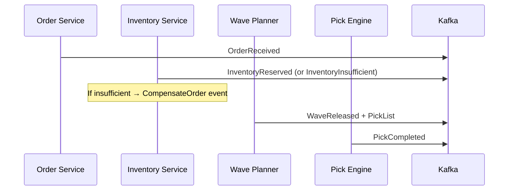
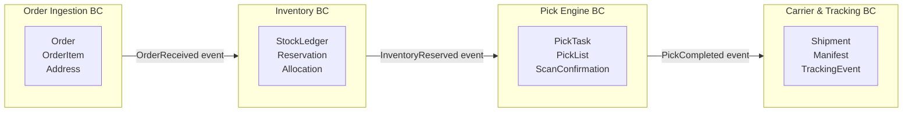
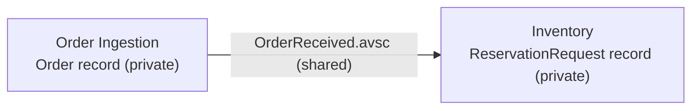

# Supplement: Event-Driven Architecture & Domain-Driven Design

**Applies to:** [SDS-fulfillment-system.md](./SDS-fulfillment-system.md)  
**Version:** 1.0  
**Date:** May 9, 2026

This supplement defines how EDA and DDD are applied together in this system, the invariants that must be upheld, and the pitfalls to avoid.

---

## 1. Event-Driven Architecture

### 1.1 Core concepts

| Concept | Definition | Example in this system |
|---------|-----------|----------------------|
| **Domain Event** | An immutable fact that something meaningful happened inside a bounded context | `OrderReceived`, `InventoryReserved`, `PickCompleted` |
| **Event Producer** | The bounded context (service) that owns the event and publishes it | Order Ingestion publishes `OrderReceived` |
| **Event Consumer** | A bounded context that reacts to events it did not produce | Inventory Service consumes `OrderReceived` to trigger reservation |
| **Event Backbone** | The durable transport layer decoupling producers from consumers | Apache Kafka 3.8 (KRaft, self-hosted) |
| **Choreography** | Consumers react autonomously to events; no central orchestrator | Default pattern across all domains |
| **Orchestration** | A workflow engine drives step sequencing | Temporal used only for complex long-running carrier exception flows |

### 1.2 Event anatomy

Every domain event published to Kafka must carry:

```avro
{
  "name":         "<EventName>",       // PascalCase, past-tense verb
  "namespace":    "com.shipping.events",
  "fields": [
    {"name": "orderId",        "type": "string"},   // aggregate identity
    {"name": "eventTime",      "type": {"type": "long", "logicalType": "timestamp-millis"}},
    {"name": "schema_version", "type": "string", "default": "1.0"}
  ]
}
```

Rules:
- **Past tense, noun phrase** — `OrderReceived`, not `ReceiveOrder` or `OrderEvent`.
- **Owned by one bounded context** — only the producer's schema is canonical. Consumers map to their own internal model.
- **Avro schema registered in Confluent Schema Registry OSS** before first publish; backward-compatible evolution only.
- **No commands as events** — a Kafka message that says "please do X" is a command, not an event. Commands belong in the request body or a dedicated command topic.

### 1.3 Delivery guarantees

| Scenario | Guarantee | Mechanism |
|----------|-----------|-----------|
| Normal publish | At-least-once | Kafka producer `acks=all`; retries enabled |
| Duplicate on retry | Consumer idempotency | ScyllaDB LWT / Valkey dedup key per `(event_id, consumer_group)` |
| Ordering | Per-partition | Partition key = aggregate identity (e.g. `order_id`, `tracking_number`) |
| Poison message | Dead-letter | Dedicated `-dlq` topic per consumer group; Alertmanager alert on DLQ depth |

### 1.4 Saga / choreography pattern

Long-running workflows (order → ship) are implemented as choreographed sagas:



Compensation (rollback) is a **forward event** (`CompensateInventory`, `CancelOrder`), never a direct DB mutation from an external service.

---

## 2. Domain-Driven Design (DDD)

### 2.1 Strategic DDD — Bounded Contexts

Each microservice is a **bounded context**: it owns its domain model, its ubiquitous language, and its persistence. No service shares a database with another.



**Context mapping relationships used:**

| Relationship | Upstream | Downstream | Integration |
|-------------|----------|------------|-------------|
| **Published Language** | Order Ingestion | All consumers | Avro schemas in `libs/common-events`; consumers adapt to their own model |
| **Conformist** | Inventory | Order (for `OrderReceived` shape) | Inventory maps the canonical event to its own `Reservation` model |
| **Anti-Corruption Layer (ACL)** | Carrier & Tracking | Carrier SDKs (UPS/FedEx) | Spring Boot webhook mapper normalises carrier-specific payloads to `TrackingEvent` |

### 2.2 Tactical DDD — Building blocks

| Building Block | Role | Implementation in this system |
|---------------|------|-------------------------------|
| **Entity** | Has identity; mutable lifecycle | `Order`, `PickTask` — implemented as **immutable records** with wither methods |
| **Value Object** | No identity; defined by its attributes | `Address`, `OrderItem`, `TrackingEventView` — plain `record` types |
| **Aggregate** | Cluster of entities + value objects; one aggregate root; enforces invariants | `Order` (root), `PickTask` (root) — currently thin; invariants partially in command handlers (see §3 gap) |
| **Domain Event** | Fact raised by an aggregate transition | `OrderReceived`, `InventoryReserved`, `PickCompleted` — Avro records in `libs/common-events` |
| **Repository** | Persistence abstraction behind the domain | `OrderRepository`, `InventoryRepository`, `PickTaskRepository` — return domain records, hide ScyllaDB |
| **Domain Service** | Stateless logic that doesn't fit one aggregate | FC Router (multi-aggregate routing logic); Carton recommender (cross-SKU bin-packing) |
| **Application Service** | Orchestrates use-case; owns transaction boundary | `CommandHandler` implementations — the CQRS write-side handler *is* the application service |
| **Factory** | Complex object construction | `Order.newOrder(…)` static factory inside the record body |

---

## 3. Using EDA and DDD Together — Best Practices

### Rule 1 — Aggregates raise events; handlers publish them

The current codebase has command handlers publishing events directly. The target pattern is:

```
Handler → calls aggregate method
         → aggregate returns (newState, domainEvent)
         → handler saves newState via repository
         → handler publishes domainEvent via DomainEventPublisher
```

**Current (workable):**
```java
// CreateOrderCommandHandler
Order order = Order.newOrder(...);
orderRepository.save(order);
kafkaProducer.publishOrderReceived(order);   // handler decides what to publish
```

**Target (DDD-pure):**
```java
// Order record
public record Order(...) {
    public record Transitioned(Order next, DomainEvent event) {}

    public Transitioned receive() {
        // enforces invariant: can only receive a fresh order
        return new Transitioned(this.withStatus(Status.RECEIVED), new OrderReceived(this));
    }
}

// CreateOrderCommandHandler — becomes a thin coordinator
var result = Order.newOrder(...).receive();
orderRepository.save(result.next());
publisher.publish(result.event());
```

The four-step handler (`load → call → save → publish`) is hard to get wrong and keeps business rules inside the aggregate.

### Rule 2 — One aggregate per transaction

A command handler must **not** modify two aggregates in a single transaction. If `CreateOrder` needs to touch both `Order` and `Inventory`, it must:
1. Modify and save `Order`.
2. Publish `OrderReceived`.
3. Let `Inventory` react asynchronously via Kafka.

This maps directly to the choreography saga pattern already in use.

### Rule 3 — Events cross bounded context boundaries; domain models do not

`OrderReceived` (the Avro record from `libs/common-events`) crosses the wire. The `Order` record (from `com.shipping.order.domain.model`) never leaves the Order Ingestion service. The Inventory Service maps `OrderReceived` fields to its own `ReservationRequest` value object at the consumer boundary.



**Anti-pattern to avoid:** sharing domain model JARs across services (creates hidden coupling between bounded contexts).

### Rule 4 — Commands are internal; events are external

| Concept | Scope | Example |
|---------|-------|---------|
| `Command` (CQRS) | In-process, within one bounded context | `CreateOrderCommand` — lives only inside Order Ingestion |
| `DomainEvent` (Kafka) | Cross-context, over the event backbone | `OrderReceived` — consumed by Inventory, Wave Planner, etc. |

Never expose a `Command` record to another service. If another service needs to trigger an action, it publishes an event; the receiving service turns it into a command internally.

### Rule 5 — Read models are not aggregates

Query handlers return **read models** (`XxxView`, `XxxResult`) — flat, denormalised projections optimised for a specific consumer. They are assembled from the read store (PostgreSQL, OpenSearch) and must not be passed back to a command handler or mutated.

### Rule 6 — Ubiquitous language in code

Code identifiers must match the domain language used by warehouse operators:

| Domain term | Correct identifier | Anti-pattern |
|-------------|-------------------|--------------|
| Pick task | `PickTask`, `CreatePickTasksCommand` | `PickJob`, `PickRecord` |
| Wave release | `WaveReleased` (event), `WaveRelease` (command) | `BatchRelease`, `PickBatch` |
| Reservation | `ReserveInventoryCommand`, `InventoryReserved` | `LockStock`, `HoldItem` |
| Carrier handoff | `TransmitManifestCommand` | `SendToUPS`, `ShipOrder` |

### Rule 7 — Eventual consistency is the default; strong consistency is the exception

| Scenario | Consistency model | Mechanism |
|----------|------------------|-----------|
| Inventory reservation (money-like) | **Strong** | ScyllaDB LWT (`IF` condition) + Valkey Lua atomic decrement |
| Order status visible to ops dashboard | **Eventual** | Kafka consumer updates PostgreSQL read model; lag < 1s under normal load |
| Tracking event timeline | **Eventual** | Carrier webhook → Kafka → ScyllaDB append; consumers see events in order |
| Inventory search / reporting | **Eventual** | OpenSearch updated asynchronously from `inventory-events` topic |

Do not default to strong consistency. Each strong-consistency boundary is a scaling bottleneck and must be justified.

### Rule 8 — Aggregate size: keep it small

An aggregate should be the **minimum cluster of objects that must change together to enforce one invariant**. Signs an aggregate is too large:
- A command handler loads the aggregate but only touches 20% of its fields.
- Two independent commands always modify different sub-objects of the same aggregate.
- Tests require building a large object graph just to exercise one rule.

`Order` owns `List<OrderItem>` because item totals and item-level status are part of order-level invariants. It does **not** own `Shipment` (a different lifecycle, different aggregate root in Carrier & Tracking).

---

## 4. Anti-Patterns Reference

| Anti-pattern | Symptom | Correct approach |
|-------------|---------|-----------------|
| **Event as command** | Event name is imperative: `ShipOrder`, `ReserveStock` | Use past-tense facts: `OrderShipped`, `StockReserved` |
| **Shared domain model JAR** | `common-domain` module imported by multiple services | Each BC owns its own model; share only Avro schemas via `common-events` |
| **God aggregate** | `Order` contains `Shipment`, `Invoice`, `Return` | Separate aggregate per BC; coordinate via events |
| **Synchronous saga** | Service A calls Service B REST to complete a multi-step flow | Choreography via Kafka events; compensate with forward events |
| **Query in command handler** | `CommandHandler` calls `QueryHandler` to validate a read | Load state via repository directly; never call a query handler from a command handler |
| **Domain logic in repository** | `OrderRepository.saveAndPublish(…)` | Repository only persists; command handler publishes |
| **Anemic domain model** | All logic in handlers; records are plain data bags | Move invariant enforcement and state transitions into aggregate methods |
| **Swallowing DLQ messages** | Consumer silently discards poison messages | Route to `-dlq` topic; alert on depth; replay after fix |
